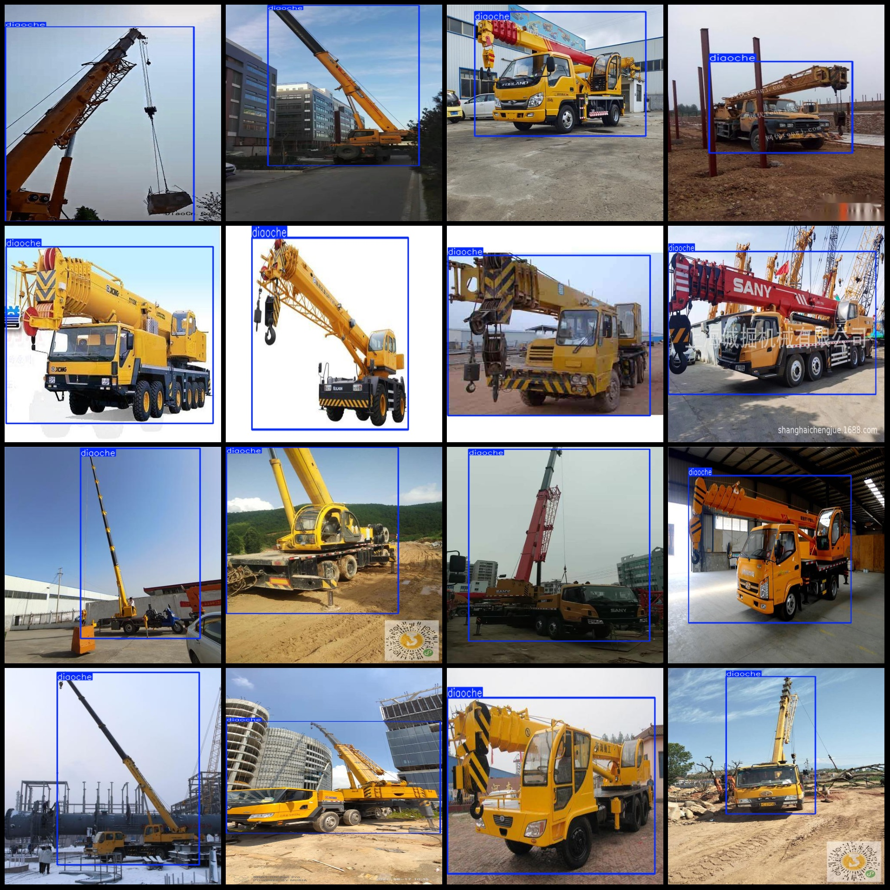
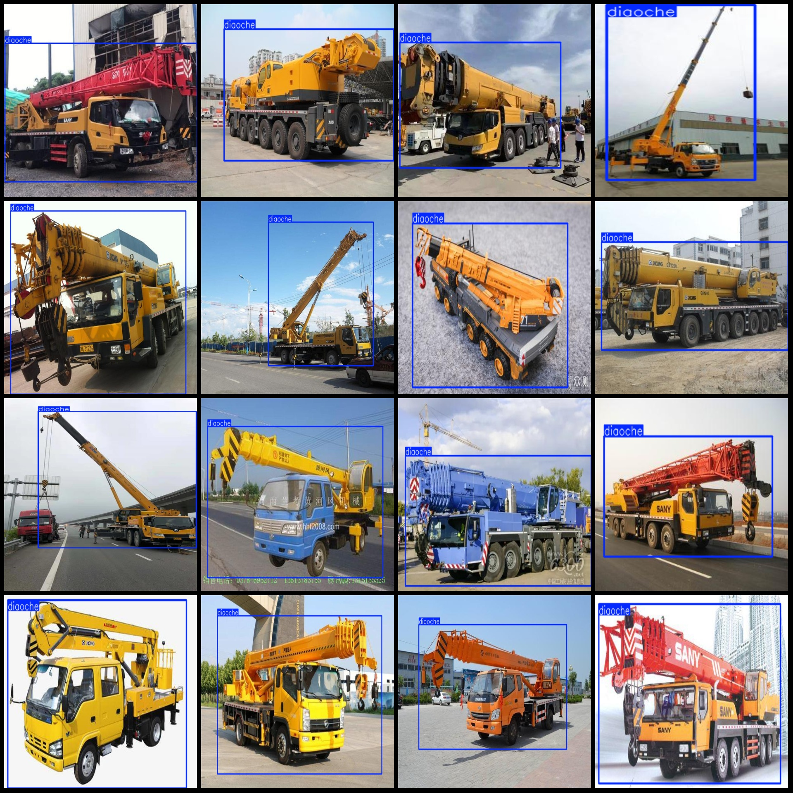

# Vision Inspection Data Set (VOC+YOLO) with 726 images in 1 category

Dataset format: Pascal VOC format + YOLO format (without split path in txtfile, just containing jpgimage and corresponding VOC format xmlfile and yolo format txtfile)
The number of images (number of jpg files): 726
annotation count:  726
annotation count: 726  
annotationnumber of classes: 1  
annotation class names:["diaoche"]  
boxes per class:   
diaoche box count = 759  
Total Frame Count: 759
The number of pictures each category contains:
diaoche images = 726  
Image resolution: Multi-resolution images, such as 500x674, 500x375, etc.
Using a labeling tool: labelImg
Markup Rule: Draw a rectangle around the category.
Important Note: The dataset does not have a division into train, validation, and test sets.
Special Statement: This dataset does not guarantee the accuracy of the trained model or weights file.
Preview Image:
## Images

Here is a pay link on Stripe ( https://buy.stripe.com/3cs8yP7sY87d0vu9AB ). Please contact me lonlonago@foxmail.com after funding $89, and I will send you a complete data files , thank you!

